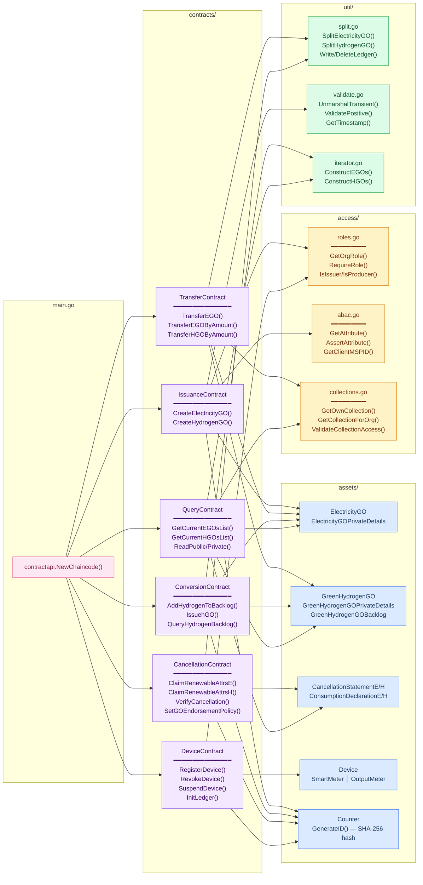
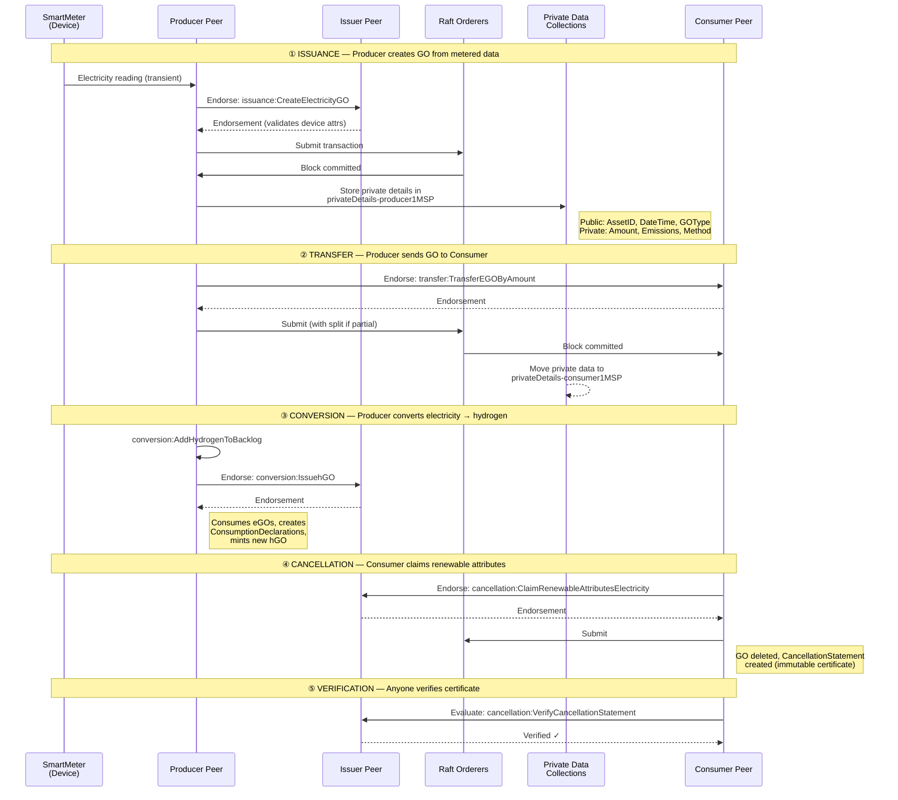
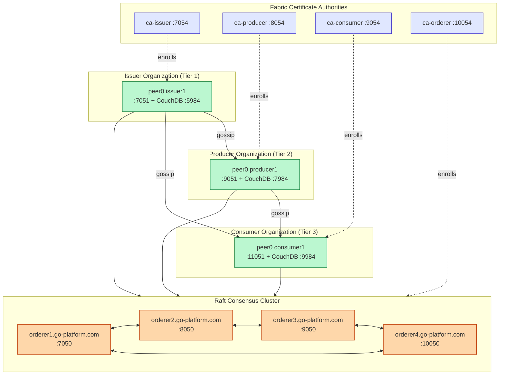
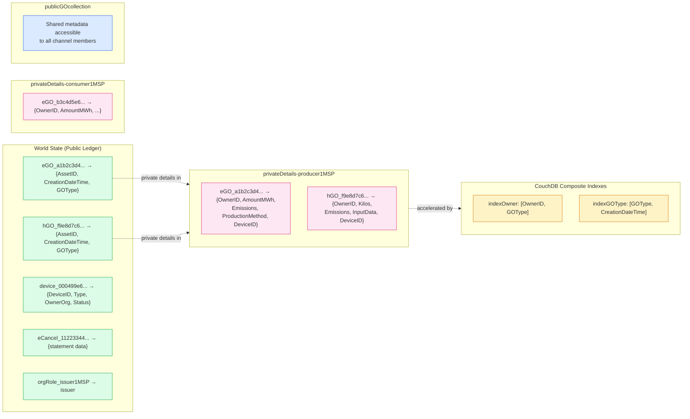
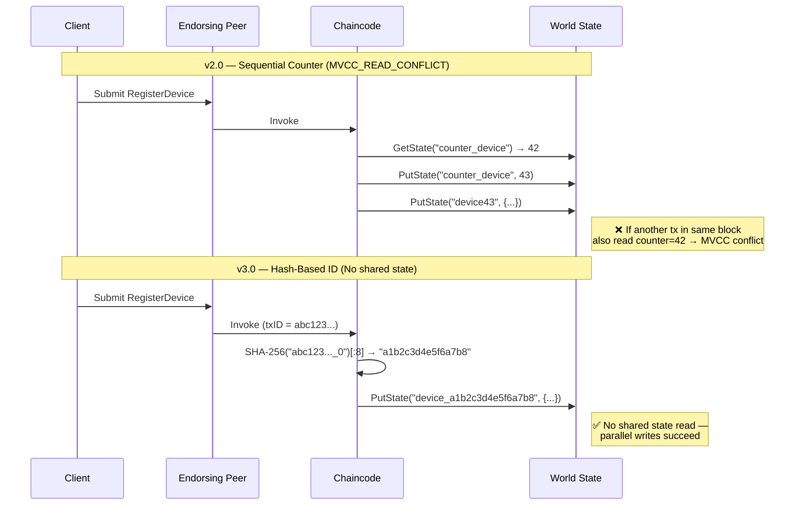

# GO Platform v3 — Architecture Diagrams

> Architecture diagrams for the Hyperledger Fabric Guarantee of Origin platform.
> Updated for v3.0 (hash-based IDs, CouchDB indexes, reduced BatchTimeout).
> Diagrams use [Mermaid](https://mermaid.js.org/) syntax and render natively on GitHub.

---

## 1. System Architecture Overview

Shows the full three-tier stack: React frontend → Express backend → Hyperledger Fabric network with tiered organizations.

```mermaid
graph TB
    subgraph Frontend["🖥️ React Frontend · Vite + Tailwind CSS"]
        direction TB
        LP[LoginPage]
        DP[DashboardPage]
        DEV[DevicesPage]
        GP[GuaranteesPage]
        TP[TransfersPage]
        CP[ConversionsPage]
        CTP[CertificatesPage]
    end

    subgraph Backend["⚙️ Express.js Backend · TypeScript"]
        direction TB
        AUTH[Auth Middleware<br/>JWT + RBAC]
        subgraph Routes["REST API Routes"]
            R1[/api/auth]
            R2[/api/devices]
            R3[/api/guarantees]
            R4[/api/transfers]
            R5[/api/conversions]
            R6[/api/cancellations]
            R7[/api/queries]
        end
        GW["Fabric Gateway<br/>@hyperledger/fabric-gateway<br/>gRPC + TLS"]
    end

    subgraph Fabric["🔗 Hyperledger Fabric 2.x Network"]
        direction TB
        subgraph Orderers["Raft Orderer Cluster"]
            O1[orderer1<br/>:7050]
            O2[orderer2<br/>:8050]
            O3[orderer3<br/>:9050]
            O4[orderer4<br/>:10050]
        end
        subgraph Channel["GOPlatformChannel"]
            subgraph Issuer["🏛️ Tier 1 — Issuer"]
                IP[peer0.issuer1<br/>:7051]
                ICA[CA issuer<br/>:7054]
                IDB[(CouchDB)]
            end
            subgraph Producer["🏭 Tier 2 — Producer"]
                PP[peer0.producer1<br/>:9051]
                PCA[CA producer<br/>:8054]
                PDB[(CouchDB)]
            end
            subgraph Consumer["🏠 Tier 3 — Consumer"]
                COP[peer0.consumer1<br/>:11051]
                CCA[CA consumer<br/>:9054]
                CDB[(CouchDB)]
            end
        end
        subgraph Chaincode["📜 Go Chaincode · 6 Named Contracts"]
            CC1[issuance<br/>CreateElectricityGO<br/>CreateHydrogenGO]
            CC2[transfer<br/>TransferEGO<br/>TransferByAmount]
            CC3[conversion<br/>AddHydrogenToBacklog<br/>IssuehGO]
            CC4[cancellation<br/>ClaimRenewableAttributes<br/>VerifyCancellation]
            CC5[query<br/>GetGOsList<br/>ReadPublic / ReadPrivate]
            CC6[device<br/>RegisterDevice<br/>RevokeDevice]
        end
        subgraph PDC["🔒 Private Data Collections"]
            PUB[publicGOcollection<br/>All orgs]
            PRV1[privateDetails-issuer1MSP]
            PRV2[privateDetails-producer1MSP]
            PRV3[privateDetails-consumer1MSP]
        end
    end

    Frontend -->|HTTP/JSON| AUTH
    AUTH --> Routes
    Routes --> GW
    GW -->|gRPC + TLS| IP
    GW -->|gRPC + TLS| PP
    GW -->|gRPC + TLS| COP
    IP --> Chaincode
    PP --> Chaincode
    COP --> Chaincode
    Chaincode --> PDC
    IP --> IDB
    PP --> PDB
    COP --> CDB
    O1 --- O2
    O2 --- O3
    O3 --- O4

    classDef frontend fill:#dbeafe,stroke:#2563eb,color:#1e3a5f
    classDef backend fill:#fef3c7,stroke:#d97706,color:#78350f
    classDef fabric fill:#dcfce7,stroke:#16a34a,color:#14532d
    classDef chaincode fill:#f3e8ff,stroke:#7c3aed,color:#3b0764
    classDef pdc fill:#fce7f3,stroke:#db2777,color:#831843

    class LP,DP,DEV,GP,TP,CP,CTP frontend
    class AUTH,R1,R2,R3,R4,R5,R6,R7,GW backend
    class IP,PP,COP,ICA,PCA,CCA,IDB,PDB,CDB,O1,O2,O3,O4 fabric
    class CC1,CC2,CC3,CC4,CC5,CC6 chaincode
    class PUB,PRV1,PRV2,PRV3 pdc
```

---

## 2. Chaincode Internal Architecture — Package Dependencies

Shows how the 6 named contracts in `contracts/` depend on shared packages: `assets/`, `access/`, and `util/`.



---

## 3. GO Lifecycle Sequence — Issuance → Transfer → Conversion → Cancellation → Verification

Shows the end-to-end flow of a Guarantee of Origin through the system, from metered data to verified certificate.



---

## 4. Network Topology



---

## 5. Data Architecture — Public vs. Private State



---

## 6. v3.0 ID Generation Flow

Shows how v3.0 generates contention-free IDs from the transaction ID, eliminating the MVCC_READ_CONFLICT bottleneck.


